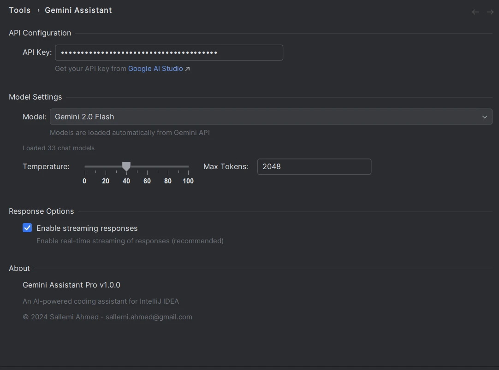
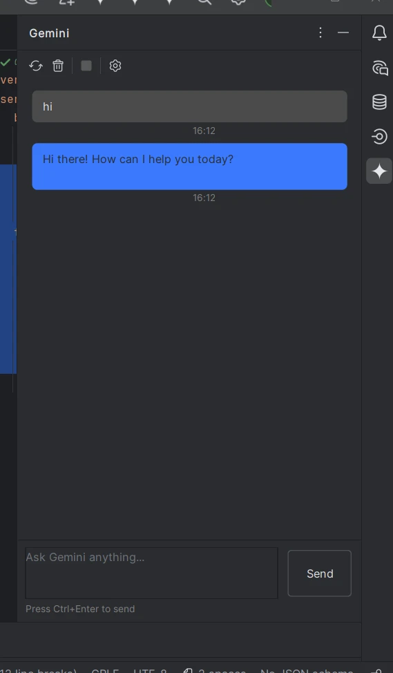
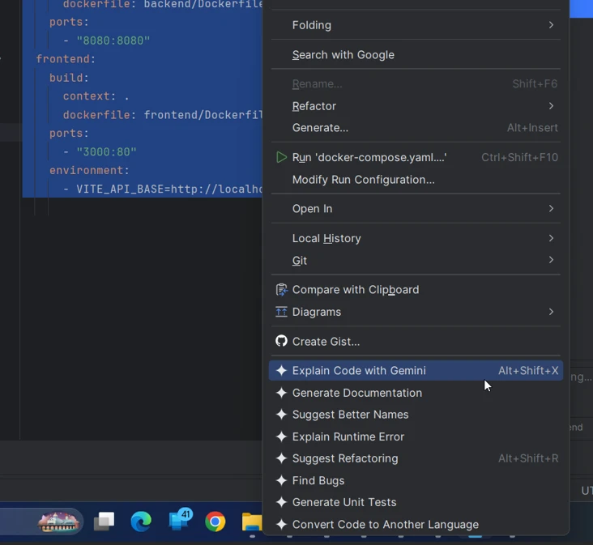

# Gemini Assistant Pro for IntelliJ IDEA

An AI-powered coding assistant plugin that integrates Google Gemini AI models directly into IntelliJ IDEA.


## Features

- **Chat Interface** - Interactive chat with Gemini AI directly in your IDE
- **Syntax Highlighting** - Code blocks in responses are displayed with full syntax highlighting
- **Multiple AI Actions** - Quick access to AI features from the editor context menu
- **Streaming Responses** - Real-time streaming of AI responses
- **33+ Gemini Models** - Support for all available Gemini chat models

## Screenshots

### Settings Panel
Configure your API key, select models, and adjust response parameters.



### Chat Interface
Chat with Gemini AI directly in the tool window with syntax-highlighted code blocks.



### Editor Context Menu
Access AI features directly from your code editor.



## Installation

1. Download the plugin from the [Releases](https://github.com/sallemiahmed/Gemini-intellij-plugin/releases) page
2. In IntelliJ IDEA, go to **Settings** → **Plugins** → **⚙️** → **Install Plugin from Disk**
3. Select the downloaded `.zip` file
4. Restart IntelliJ IDEA

## Configuration

1. Go to **Settings** → **Tools** → **Gemini Assistant**
2. Enter your Google AI API key (get one from [Google AI Studio](https://aistudio.google.com/apikey))
3. Select your preferred Gemini model
4. Adjust temperature and max tokens as needed

## Available Actions

| Action | Shortcut | Description |
|--------|----------|-------------|
| Explain Code | `Alt+Shift+X` | Explain selected code |
| Chat with Gemini | `Ctrl+Shift+G` | Open chat with selected code |
| Suggest Refactoring | `Alt+Shift+R` | Get refactoring suggestions |
| Find Bugs | - | Analyze code for potential bugs |
| Generate Tests | - | Generate unit tests |
| Generate Documentation | - | Generate code documentation |
| Suggest Better Names | - | Get naming suggestions |
| Convert Language | - | Convert code to another language |

## Building from Source

### Prerequisites

- Java 21+
- IntelliJ IDEA 2025.2.5+

### Build

```bash
./gradlew build
```

### Run Development Instance

```bash
./gradlew runIde
```

## Project Structure

```
src/main/kotlin/com/sallemi/gemini/
├── actions/          # Editor context menu actions
├── api/              # Gemini API client
├── services/         # Core services and intents
├── settings/         # Plugin settings
└── ui/               # Tool window and chat components
```

## Tech Stack

- **Language**: Kotlin 2.2.0
- **Platform**: IntelliJ Platform SDK
- **API**: Google Gemini API (v1beta)
- **UI**: IntelliJ Platform UI components with native editor for code highlighting

## Author

**Sallemi Ahmed** - [sallemi.ahmed@gmail.com](mailto:sallemi.ahmed@gmail.com)

## License

This project is licensed under the MIT License - see the [LICENSE](LICENSE) file for details.

---

*Made with ❤️ for the IntelliJ community*
